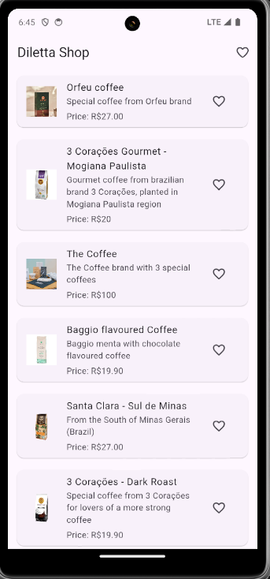
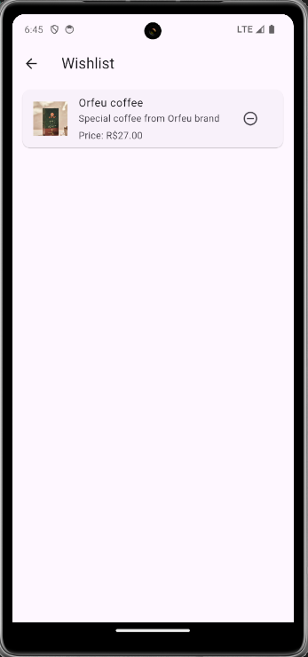
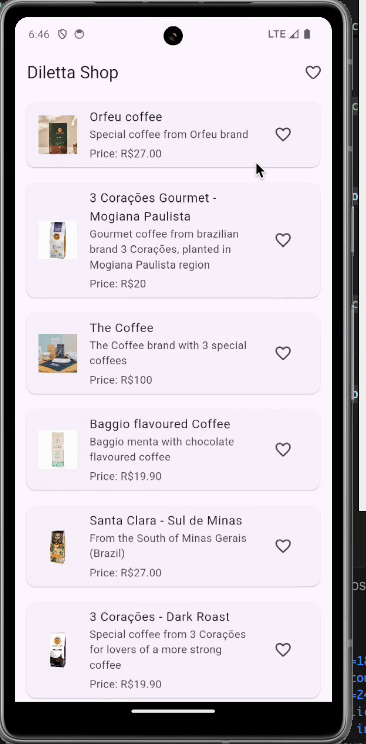

# diletta_shop

Your shopping app for buying good coffees near you.

## Screenshots
  

  



## Requirements
This project uses the Flutter 3.22.2 version and a Dart SDK 3.4.3.  
Everything else is the Flutter default configuration.

## How to run the app

1. Clone the repository or download this repository.
2. Open the project in Android Studio or Visual Studio Code.
3. Install the required dependencies using `flutter pub get` command.
4. Run the app on your device or emulator using `flutter run` command.

### Running the tests

To run the tests, you can use the following command:

```bash
flutter test
```

This command will run all the tests in the project.

## Architecture

The app is built using the following architecture Clean Architecture pattern.

The project is divided into three layers following the [Clean Architecture](https://blog.cleancoder.com/uncle-bob/2012/08/13/the-clean-architecture.html) pattern:

- The core layer: this layer contains core functionality and utilities that are used across the other layers.
- The presentation layer: This layer contains the UI components and the logic for handling user interactions.
- The domain layer: This layer contains the business logic, the data models and the usecases.
- The data layer: This layer contains the data access layer and the repositories.
- The Shared layer: This layer contains the services and utilities that are used across the other layers.

The presentation layer is responsible for handling the user interactions and updating the UI. It uses the domain layer to perform the business logic and interacts with the data layer to retrieve and store data.

The domain layer contains the business logic and the data models. It uses the data layer to interact with the data and performs validation and transformations.

The data layer contains the data access layer and the repositories. It provides a way to access and manipulate the data in a consistent and reliable manner.

The shared layer contains abstractions and utilities that are used across the other layers. It provides a way to share code and resources between the layers and improve code reusability, reduce coupling, and increase maintainability.

## Project Structure

```
└── 📁lib
    └── 📁core
        └── 📁di
            └── service_locator.dart
        └── 📁failures
            └── failures.dart
        └── 📁usecases
            └── usecase.dart
        └── 📁utils
            └── app_config.dart
    └── 📁features
        └── 📁products
            └── 📁data
                └── 📁models
                    └── product_model.dart
                └── 📁repositories
                    └── cache.dart
                    └── endpoints.dart
                    └── wishlist_product_repository.dart
            └── 📁domain
                └── 📁entities
                    └── product.dart
                └── 📁repositories
                    └── product_repository.dart
                └── 📁usecases
                    └── fetch_products.dart
                    └── fetch_wishlist.dart
                    └── save_to_wishlist.dart
            └── 📁presentation
                └── 📁bloc
                    └── product_bloc.dart
                    └── product_event.dart
                    └── product_state.dart
                └── 📁pages
                    └── products_page.dart
                    └── wishlist_page.dart
                ├── widgets
    └── 📁shared
        └── 📁services
            └── 📁cache
                └── cache_service.dart
                └── hive_cache_service.dart
            └── 📁http
                └── dio_http_service.dart
                └── http_result.dart
                └── http_service.dart
    └── main.dart
```